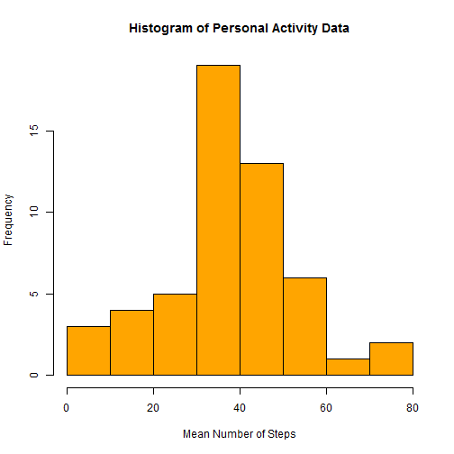
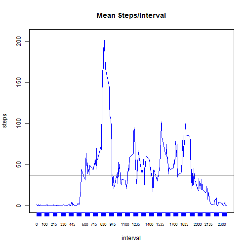
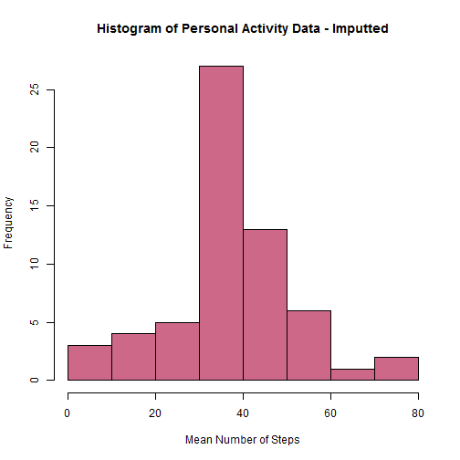
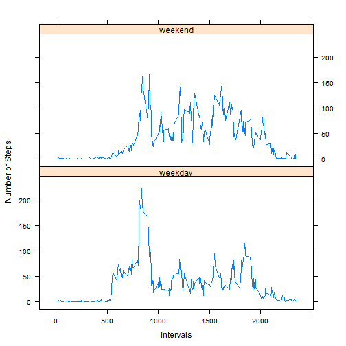

# Coursera Reproducible Research
### Peer Assessment 1 - PA1_template.Rmd File Submission


This document is being submitted for the Peer Assessment 1 of the Coursera Reproducible Research course.

Each section below has a breif note, followed by the code and then the results of the analysis as per the instructions that were provided.


## Read file and create df for histrogram without NA values


Load required libraries

```r
library(plyr)
library(dplyr)
library(reshape)
library(data.table)
library(sqldf)
library(tcltk)
library(rmarkdown)
library(knitr)
library(Hmisc)
library(timeDate)
```

```
## Warning: package 'timeDate' was built under R version 3.1.3
```

```r
library(lattice)


require(plyr)
require(dplyr)
require(reshape)
require(data.table)
require(sqldf)
require(tcltk)
require(rmarkdown)
require(knitr)
require(Hmisc)
require(timeDate)
require(lattice)
```


## Loading and preprocessing the data

```r
## read activity data into a df

mydata <- read.csv("activity.csv")


## create df with out NA values
mydata.1 <-mydata[complete.cases(mydata), ]


## create df with mean values per day and clean up col names
mydata.1.mean <- aggregate(mydata.1[ ,1], 
                                     by = mydata.1[c("date")], FUN=mean)

colnames(mydata.1.mean)[2] <- "steps"
```


## What is mean total number of steps taken per day?

```r
## create df with out NA values
mydata.1 <-mydata[complete.cases(mydata), ]


## create df with mean values per day and clean up col names
mydata.1.mean <- aggregate(mydata.1[ ,1], 
                                     by = mydata.1[c("date")], FUN=mean)

colnames(mydata.1.mean)[2] <- "steps"
```


### Create histrogram of mean number of steps/day:


```r
## generate histogram

hist(mydata.1.mean[,2], col="orange", main="Histogram of Personal Activity Data",
          xlab = "Mean Number of Steps")
```

 


### Calculate and report mean and median number of steps taken per day


```r
## subset df to eliminate zero values
df.nonzero <- subset(mydata.1, steps > 0)

## create mean and median values
mean <- mean(df.nonzero[,1])
median <- median(df.nonzero[,1])
df.avg <- data.frame(mean, median)

print(df.avg, row.names=FALSE)
```

```
##      mean median
##  134.2607     56
```


## What is average daily activity pattern?

### Plot average number of steps at each 5-minute interval across all the days.


```r
## Create df with ave steps per interval, and clean up col names.
mydata.3.mean <- aggregate(mydata.1[ ,1], 
                           by = mydata.1[c("interval")], FUN=mean)
colnames(mydata.3.mean)[2] <- "steps"


plot(steps ~ interval, mydata.3.mean, xaxt = "n", type = "l", col="blue", main="Mean Steps/Interval")
axis(1, mydata.3.mean$interval, cex.axis = .7, col="blue")
abline(h = mean(mydata.3.mean$steps))
```

 


### Report on the specific interval that has the highest number of steps


```r
## Create df with ave steps per interval, and clean up col names.


print(subset(mydata.3.mean, steps == max(mydata.3.mean$steps)), row.names=FALSE)
```

```
##  interval    steps
##       835 206.1698
```


## Imputting missing values:

### Report on number of missing values


```r
## Calculate number of missing values in the dataset


cat(nrow(mydata) - sum(complete.cases(mydata)))
```

```
## 2304
```


### Develop new data set with imputted values to replace missing data and create a histogram

Note:  The methodology used was to calculate an average number of steps based on the non-na values avaialble for each interval per day, i.e., average of each interval allocated to NA values.  The calculated mean for each interval was rounded to integer value to represent whole steps only.


```r
#  create df copy from original
mydata.impute <- mydata


# Split the df based on intervals

mydata.split <- split(mydata.impute, mydata.impute$interval)
     
                  

# populate the NA values by imputting  the  mean value for each break in
# intervals, and round to zero decimals so as not to have
# partial steps in the data set...intergers only


list.impute <- lapply(mydata.split, function(x) 
{transform(x, steps = ifelse(is.na(steps), 
     round(mean(steps, na.rm=TRUE),0), steps))})


# re-construct the df from the list with imputted values

df.impute <- do.call("rbind", list.impute)


## re-sort df by date and then by interval like the original data


df.impute <- df.impute[order(df.impute$date, df.impute$interval, 
               df.impute$steps),]


## Calculate mean steps per day and rename value dimension

df.impute.mean <- aggregate(df.impute[ ,1], 
                           by = df.impute[c("date")], FUN=mean)
colnames(df.impute.mean)[2] <- "steps"


hist(df.impute.mean[,2], col="palevioletred3", main="Histogram of Personal Activity Data - Imputted",
     xlab = "Mean Number of Steps")
```

 

The values per the above histogram differ from the original data-set.  There is a much greater number of days where the steps are close to the mean value.

The impact of imputting these values is that although the mean, max, and min values remained the same, the 3rd quartile is a considerably higher number, as shown in the summaries below, and of course there are 2,304 more data points being reported on.


SUMMARY OF ORIGINAL DATA COMPARED TO SUMMARY OF IMPUTTED DATA


```r
## Calculate number of missing values in the dataset

print(summary(mydata))
```

```
##      steps                date          interval     
##  Min.   :  0.00   2012-10-01:  288   Min.   :   0.0  
##  1st Qu.:  0.00   2012-10-02:  288   1st Qu.: 588.8  
##  Median :  0.00   2012-10-03:  288   Median :1177.5  
##  Mean   : 37.38   2012-10-04:  288   Mean   :1177.5  
##  3rd Qu.: 12.00   2012-10-05:  288   3rd Qu.:1766.2  
##  Max.   :806.00   2012-10-06:  288   Max.   :2355.0  
##  NA's   :2304     (Other)   :15840
```

```r
print(summary(df.impute))
```

```
##      steps                date          interval     
##  Min.   :  0.00   2012-10-01:  288   Min.   :   0.0  
##  1st Qu.:  0.00   2012-10-02:  288   1st Qu.: 588.8  
##  Median :  0.00   2012-10-03:  288   Median :1177.5  
##  Mean   : 37.38   2012-10-04:  288   Mean   :1177.5  
##  3rd Qu.: 27.00   2012-10-05:  288   3rd Qu.:1766.2  
##  Max.   :806.00   2012-10-06:  288   Max.   :2355.0  
##                   (Other)   :15840
```


## Are there differences in activity patterns between weekdays and weekends?

Yes there are...as can be seen below, the is considerably more activity as measured by number of setps and frequency.


```r
## SEGREGATE DATA BETWEEN WEEKDAYS and WEEKENDS

df.impute.days <- df.impute

df.impute.days$date <- as.Date(df.impute.days$date, "%Y-%m-%d")


df.impute.days$weekday <- weekdays(df.impute.days$date)
df.impute.days$dayflag <- df.impute.days$weekday

df.impute.days$dayflag<- as.factor(revalue(df.impute.days$dayflag, 
                         c("Monday"="weekday",
                         "Tuesday"="weekday",
                         "Wednesday"="weekday",
                         "Thursday"="weekday",
                         "Friday"="weekday",
                         "Saturday"="weekend",
                         "Sunday"="weekend")))


##  aggregate by dayflag an by inteval and calculate mean


df.impute.days.mean <- aggregate(df.impute.days[ ,1], 
                              by = df.impute.days[c("dayflag", "interval")], FUN=mean)

##  Rename mean column
colnames(df.impute.days.mean)[3] <- "steps"


panels <- xyplot(steps ~ interval | dayflag, data = df.impute.days.mean, layout = c(1,2),
       type="l", xlab="Intervals", ylab="Number of Steps")


print(panels)
```

 

